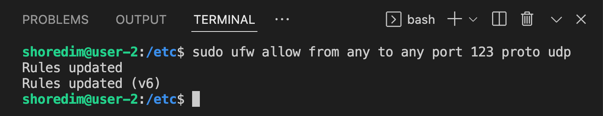
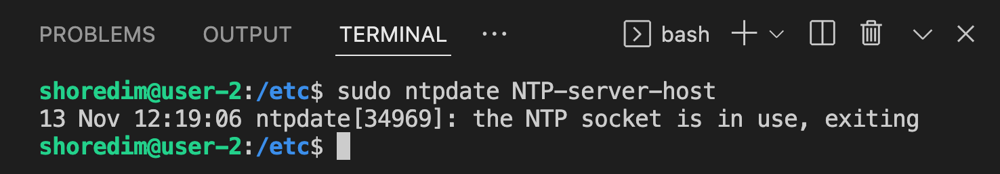
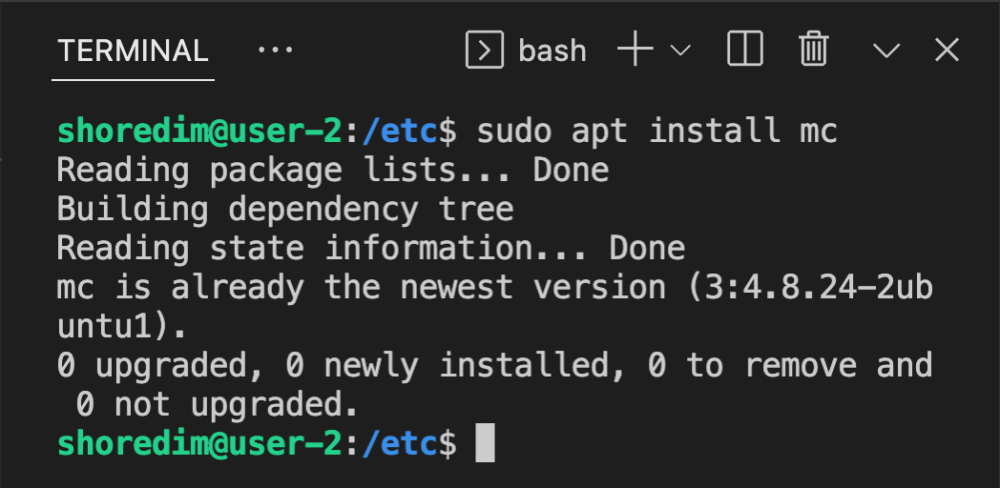
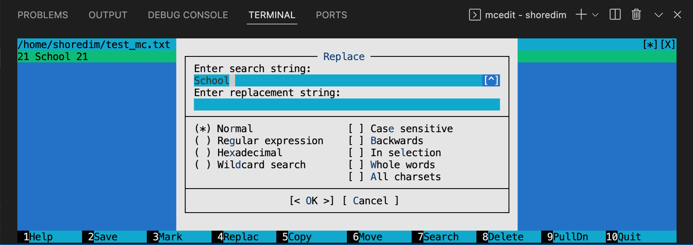
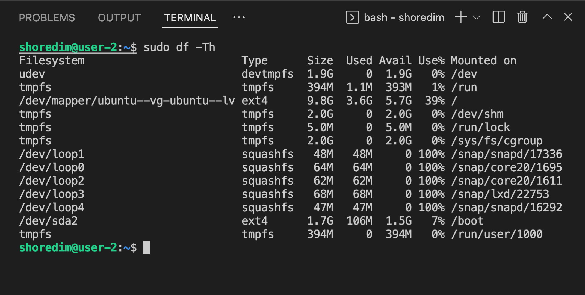
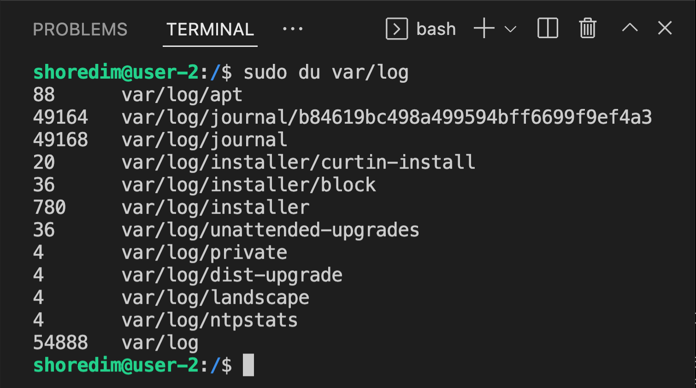
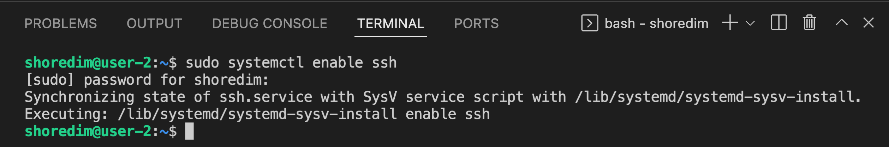

# Отчёт по D01_Linux
___

___Важная информация!!!___
Прежде чем вносить изменения  в конфигурационные файлы, им необходимо дать разрешение на запись.
Можно воспользоваться командой:

`$ sudo chmod 777 <file_name>`

## Part 1. Установка ОС

- ##### Вывод версии Ubuntu с помощью команды:
`$ cat /etc/issue`

## Part 2. Создание пользователя.

##### 2.1. Создание пользователя в Linux
Вся информация о пользователях находится в файле /etc/passwd. Мы могли бы создать пользователя linux просто добавив его туда, но так делать не следует, поскольку для этой задачи существуют специальные утилиты. 

###### Команды `useradd` и `adduser` создают новых пользователей в системе Linux. Хотя эти две команды выполняют аналогичную задачу, метод их выполнения различен. Рассмотрим их подробнее.

###### Комманда `useradd`
Это довольно простая команда для создания нового пользователя, которая есть во всех дистрибутивах Linux, то есть является переносимой. Она позволяет зарегистрировать нового пользователя или изменить информацию об уже имеющемся. Во время создания можно даже создать домашний каталог пользователя и скопировать в него системные файлы.

`useradd` это команда Linux . Для добавления и настройки активной учетной записи пользователя требуются различные параметры. Кроме того, команда позволяет изменить значения по умолчанию для процесса создания пользователя.

useraddэто низкоуровневая  команда, доступная во всех дистрибутивах Linux.

###### Рассмотрим синтаксис команды:

`$ sudo useradd <username> [options]`
`sudo useradd [options]`

Чтобы просмотреть все доступные варианты, используйте опцию (флаг) `-h`. В качестве альтернативы используйте команду `man` для просмотра полной страницы руководства.

Все довольно просто, дальше нам нужно рассмотреть основные опции команды, с помощью которых вы будете настраивать нового пользователя:
* `-b` - базовый каталог для размещения домашнего каталога пользователя, по умолчанию /home;
* `-c` - комментарий к учетной записи;
* `-d` - домашний каталог, в котором будут размещаться файлы пользователя;
* `-e` - дата, когда учетная запись пользователя будет заблокирована, в формате ГГГГ-ММ-ДД;
* `-f` - заблокировать учетную запись сразу после создания;
* `-g` - основная группа пользователя;
* `-G` - список дополнительных групп;
* `-k` - каталог с шаблонами конфигурационных файлов;
* `-l` - не сохранять информацию о входах пользователя в lastlog и faillog;
* `-m` - создавать домашний каталог пользователя, если он не существует (по умолчанию не создаётся);
* `-M` - не создавать домашнюю папку;
* `-N` - не создавать группу с именем пользователя;
* `-o` - разрешить создание пользователя linux с неуникальным идентификатором UID;
* `-p` - задать пароль пользователя;
* `-r` - создать системного пользователя, не имеет оболочки входа, без домашней директории и с идентификатором до SYS_UID_MAX;
* `-s` - командная оболочка для пользователя;
* `-u` - идентификатор для пользователя;
* `-D` - отобразить параметры, которые используются по умолчанию для создания пользователя. Если вместе с этой опцией задать еще какой-либо параметр, то его значение по умолчанию будет переопределено.

###### Комманда `adduser`
Команда  `adduser` создает нового пользователя в системе Linux с помощью интерактивной подсказки. Высокоуровневая оболочка написана на Perl и является интерфейсом для  `useradd`.

Запуск команды создает домашний каталог, добавляет оболочку по умолчанию как `Bash` и предлагает пользователю ввести пароль для разблокировки учетной записи.

Однако эта команда не дает большого контроля над деталями создания пользователя. Команда adduser является командой более высокого уровня и доступна не во всех дистрибутивах Linux, а, следовательно, не является переносимой.

Чтобы увидеть, как работает `adduser`, выполните в терминале следующую команду:

`sudo adduser <username>`

Замените `<username>` на имя нового пользователя.

Команда запускает программу, которая проводит пользователя через процесс создания в интерактивном интерфейсе. Команда создает __активную учетную запись__ пользователя в системе.

Чтобы просмотреть все параметры с кратким описанием команды adduser, запустите:

`adduser -h`

В качестве альтернативы используйте команду `man adduser` для просмотра полной страницы руководства.

###### Какая команда лучше: useradd __vs__ adduser

Основное различие между командами `useradd` и `adduser` заключается в том, как выполняются эти две команды:

* Команда `useradd` более низкого уровня и доступна во всех дистрибутивах Linux. Для полной настройки учетной записи требуются дополнительные параметры.

* Команда `adduser` более высокого уровня и доступна не во всех дистрибутивах Linux. Команда добавляет пользователя в систему со стандартными настройками.

###### useradd __vs__ adduser: какую из них следует использовать?

Команды  `useradd`  и  `adduser`  добавляют в систему нового пользователя, но выполняются по-разному.

Команда `adduser` удобна для настройки обычного пользователя со *стандартными пресетами (параметрами), такими как пароль и оболочка `Bash`. `adduser` предоставляет руководства по процессу создания пользователя в интерактивной подсказке. Таким образом, команда `adduser` является удобным для новичков способом добавления нового пользователя.

Команда `useradd` обеспечивает полный контроль над процессом создания пользователя. С дополнительными опциями `useradd` выполняет те же задачи, что и `adduser`. Дополнительным преимуществом является то, что эта команда переносима на разные системы Linux и более удобна для сценариев (скриптов) `Bash`.

___*Примечание.___ Независимо от того, как был создан пользователь, вы можете изменить существующего пользователя с помощью команды `usermod`.

- ##### Создание пользователя (`useradd`) и добавление его в группу (`-g`) `adm`. Дополнительно, создание каталога пользователя (`-m`), задание пароля нового пользователя (`-p`):
 
`$ sudo useradd admin -m -g adm -p q`

: groups admin")

##### 2.2. Вывод пользователей командой: `$ cat /etc/passwd`

: id admin")

## Part 3. Настройка сети ОС

___*Hostname___ (имя компьютера, имя хоста) задается во время установки системы Linux. Hostname определяет название компьютера и используется преимущественно для идентификации компьютера в сети. Нельзя назначать два одинаковых Hostname для компьютеров в одной сети. Чтобы проверить текущее имя хоста вашей системы Ubuntu, используйте одну из двух доступных команд.
Команда `hostname` - отображает только само имя хоста.

___*Примечание.___ Допустимые имена хостов имеют длину от 2 до 64 символов. Они могут содержать только буквы, цифры, точки и дефисы, но должны начинаться и заканчиваться только буквами и цифрами.

###### Временно изменить имя хоста в Ubuntu 20.04

Используйте команду `hostname`, чтобы временно изменить имя хоста вашего компьютера.

Рассмотрим синтаксис. В терминале введите следующее, заменив new-hostname на выбранное новое временное имя:

`$ sudo hostname new-hostname`

В случае успеха этот шаг не даст никаких результатов (вывода) в командной строке терминала. Чтобы подтвердить результат процесса, проверьте текущее имя хоста системы:

###### Изменить имя хоста в Ubuntu 20.04 (перезагрузка не требуется)
Если вы хотите навсегда изменить имя хоста без перезагрузки компьютера, используйте команду `hostnamectl`.

Воспользуемся командой `hostnamectl`, чтобы установить новое значение Hostname равным `user-1`. Используется аргумент `set-hostname`. Введём следующую команду, заменив `new-hostname` на `user-1`:

`$ hostnamectl set-hostname new-hostname`

##### 3.1. Изменение названия машины (имени хоста) на `user-1`:

`$ sudo hostnamectl set-hostname user-1`

: hostname")

##### 3.2. Установка временной зоны, соответствующей территориальному расположению машины

Использование правильного часового пояса важно для многих системных задач и процессов. Например, ___*демон cron___ использует системный часовой пояс для выполнения заданий cron, а временные метки в файлах журналов основаны на том же системном часовом поясе.

___*Примечание.___ Демон cron ( crond ) - это управляемый системой исполняемый файл, работающий в памяти, с помощью которого пользователи могут планировать выполнение задач. Пользовательской командой для работы со службой cron является `crontab` (таблица cron). Файл crontab - это простой текстовый файл, который предписывает демону cron выполнять задание в определенное время или с определенным интервалом.

В Ubuntu часовой пояс системы задается во время установки, но его можно легко изменить позже. Только root или пользователь с привилегиями sudo могут устанавливать или изменять системный часовой пояс.

Рассмотрим, как установить или изменить часовой пояс в `Ubuntu 20.04` с помощью командной строки.

###### Проверка текущего часового пояса
`timedatectl` — это утилита командной строки, позволяющая просматривать и изменять системное время и дату. Он доступен во всех современных системах Linux на основе `systemd`, включая `Ubuntu 20.04`.

Чтобы распечатать в терминале часовой пояс текущей системы, вызовите `timedatectl` без каких-либо аргументов:

`$ timedatectl`

Вывод ниже показывает, что часовой пояс системы установлен на «UTC»:

: timedatectl")

Системный часовой пояс настраивается путем символической ссылки `/etc/localtime` на двоичный идентификатор часового пояса в `/usr/share/zoneinfo` каталоге.

Другой вариант просмотра часового пояса текущей системы — найти файл, на который указывает символическая ссылка:

`$ ls -l /etc/localtime`

: ls -l /etc/localtime")

Часовой пояс системы также записывается в `/etc/timezone` файл:

`$ cat /etc/timezone`

: cat /etc/timezone")

###### Изменение часового пояса с помощью команды `timedatectl`:

Прежде чем изменить часовой пояс, необходимо узнать его полное название. Временные зоны используют формат "Регион/Город".

Чтобы перечислить все доступные часовые пояса, вы можете либо вывести список файлов в каталоге `/usr/share/zoneinfo`, либо вызвать команду timedatectl с опцией `list-timezones`:

`$ timedatectl list-timezones`

: cat /etc/timezone")

Как только вы определите, какой часовой пояс соответствует местоположению вашего компьютера, выполните следующую команду от имени пользователя sudo:

`$ sudo timedatectl set-timezone your_time_zone`

: sudo timedatectl set-timezone your_time_zone")

Вызовите команду `timedatectl` для проверки изменений:

: timedatectl")

##### 3.3. Вывод названия сетевых интерфейсов с помощью консольной команды ip.

`$ ip [опции] объект команда [параметры]`

Опции - это глобальные настройки, которые сказываются на работе всей утилиты независимо от других аргументов, их указывать необязательно.

Объект - это тип данных, с которым надо будет работать, например: адреса, устройства, таблица arp, таблица маршрутизации и так далее.

Команды - какое-либо действие с объектом.

Параметры - само собой, командам иногда нужно передавать параметры, они передаются в этом пункте.

Рассмотрим опции более подробно:

* `-v`, -Version - только вывод информации об утилите и ее версии.
* `-h`, -human - выводить данные в удобном для человека виде.
* `-s`, -stats - включает вывод статистической информации.
* `-d`, -details - показывать ещё больше подробностей.
* `-f`, -family - позволяет указать протокол, с которым нужно работать, если протокол не указан, то берется на основе параметров команды. Опция должна принимать одно из значений: `bridge`, `dnet`, `inet`, `inet6`, `ipx` или `link`. По умолчанию используется `inet`, `link` - означает отсутствие протокола.
* `-o`, -oneline - выводить каждую запись с новой строки.
* `-r`,`-resolve` - определять имена хостов с помощью DNS.
* `-a`, `-all` - применить команду ко всем объектам.
* `-c`, -color - позволяет настроить цветной, доступные значения: auto, always и never.
* `-br`, `-brief` - выводить только базовую информацию для удобства чтения.
* `-4` - короткая запись для `-f inet`.
* `-6` - короткая запись для `-f inet -f inet6`.
* `-B` - короткая запись для `-f inet -f bridge`.
* `-0` - короткая запись для `-f inet -f link`.

Теперь рассмотрим самые важные объекты.

`address` или `a` - сетевые адреса.
`link` или `l` - физическое сетевое устройство.
`neighbour` или `neigh` - просмотр и управление ARP.
`route` или `r` - управление маршрутизацией.
`rule` или `ru` - правила маршрутизации.
`tunnel` или `t` - настройка туннелирования.

Теперь рассмотрим доступные команды, с помощью которых может быть выполнена настройка сети linux. Они зависят от объекта, к которому будут применяться. Вот основные команды: `add`, `change`, `del` или `delete`, `flush`, `get`, `list` или `show`, `monitor`, `replace`, `restore`, `save`, `set`, и `update`. Если команда не задана, по умолчанию используется `show` (показать).

Чтобы посмотреть все IP адреса, связанные с сетевыми интерфейсами используем команду:

`$ ip a`

: ip a")

В данном консольном выводе мы видим наличие интерфейса lo - ___*localhost___.

___*Примечание. localhost (так называемый, «местный» от англ. local, или «локальный хост», по смыслу — этот компьютер)___ 
В компьютерных сетях, стандартное, официально зарезервированное доменное имя для частных IP-адресов (в диапазоне `127.0.0.1 — 127.255.255.254`, `RFC 2606`). Для сети, состоящей только из одного компьютера, как правило, используется всего один адрес — `127.0.0.1`, который устанавливается на специальный сетевой интерфейс «внутренней петли» (англ. loopback) в сетевом протоколе TCP/IP. В Unix-подобных системах данный интерфейс обычно именуется «loN», где N — число, либо просто «__lo__».
__Loopback__ — это термин, который обычно используется для описания методов или процедур маршрутизации электронных сигналов, цифровых потоков данных, или других движущихся сущностей от их источника и обратно к тому же источнику без специальной обработки или модификаций. Первоначально он использовался для тестирования передачи или передающей инфраструктуры. При установке соединений в этой вырожденной «сети» присутствует только один компьютер, при этом сетевые протоколы выполняют функции протоколов межпроцессного взаимодействия.

Использование адреса `127.0.0.1` позволяет устанавливать соединение и передавать информацию для программ-серверов, работающих на том же компьютере, что и программа-клиент, независимо от конфигурации аппаратных сетевых средств компьютера (не требуется сетевая карта, модем, и прочее коммуникационное оборудование, интерфейс реализуется при помощи драйвера псевдоустройства в ядре операционной системы). Таким образом, для работы клиент-серверных приложений на одном компьютере не требуется изобретать дополнительные протоколы и дописывать программные модули. Примером может быть запущенный на компьютере веб-сервер и обращение к нему с этого компьютера для веб-разработки на этом компьютере без необходимости выкладывать веб-программу в сеть интернет, пока её разработка не закончена.

Традиционно адресу `127.0.0.1` однозначно сопоставляется имя хоста `.localhost` и/или `localhost.localdomain`, то есть, по умолчанию, присутствует перенаправление на себя. Есть также рекомендации к использованию специальных доменных имен, таких как `.test`, `.example` и `.invalid.(RFC 2606)`, но они еще не вошли в практику и традиционно еще по умолчанию не настроены.

В IPv6 локальному хосту сопоставляется IP-адрес `::1/128 (0:0:0:0:0:0:0:1)`.

##### 3.4. Используя консольную команду получить ip адрес устройства от DHCP сервера.

IP адрес — это числовой адрес хоста расположенного в сети, и служит для его поиска и обращения к нему. Динамически назначаемый адрес может меняться от сессии к сессии в то время, как статический не изменяется и после перезагрузки устройства.

Динамический адрес назначается протоколом динамической конфигурации хоста — DHCP, такой тип адреса чаще всего по умолчанию провайдеры выдают хостам клиентов.

Статический же адрес жестко привязывается к машине или указывается на ней вручную. Такой адрес необходим, например серверам в интернете для того, чтобы иметь возможность привязывать к ним доменные имена и пользователи сети всегда имели бы удобный инструмент обращения к конкретному узлу.

Для того чтобы точно определить, является ли IP статическим или динамическим средствами ОС явного способа не существует. Потому как практически у каждого пользователя будет указано DHCP, ведь практически все компьютеры сейчас подключены через роутер который динамически раздает клиентам адреса. Самый верный способ узнать какой у тебя тип IP — это мониторить свой внешний адрес каждый раз при перезагрузке устройства — если он изменяется — то он динамический.

Но бывает так, что возникает необходимость проверить, нет ли на узле жестко прописанного IP адреса, именно такую задачу мы сейчас и решим.

Узнаем тип адреса у интерфейса.
Для этого используем команду ip в терминале:

`$ ip r`

На скриншоте ниже видно, что IP интерфейсу присвоен динамически, т.к. в выводе присутствует аббр. DHCP:

: ip r")

Соответственно если в выводе данная аббр. отсутствует — это будет означать, что IP статический.

Данный метод проверки подойдет особенно тогда, когда подключение к компьютеру производится удаленно, т.к. действие осуществляется из командной строки.

___Dynamic Host Configuration Protocol (DHCP)___ — автоматически предоставляет IP адреса и прочие настройки сети (маску сети, шлюз и т.п) компьютерам и различным устройствам в сети.

Клиент настроенный на получение адреса по протоколу DHCP посылает запрос к серверу, и тот в свою очередь предоставляет свободный IP адрес клиенту во временное пользование — в аренду. Срок аренды IP адреса настраивается на сервере. DHCP позволяет значительно уменьшить затраченное время на настройку сети, так же позволяет подключать клиента из одной сети в другую без изменения сетевых параметров. Для провайдеров услуг — DHCP позволяет экономить на пуле IP адресов, и присвоить статический IP любому оборудованию.

Назначение DHCP:

1. Запрос на аренду: Клиент передает запрос на сервер DHCP с адресом источника `0.0.0.0` и адресом назначения `255.255.255.255`. Запрос включает MAC-адрес, который используется для направления ответа от сервера.
2. Предложение аренды IP-адреса: сервер DHCP отвечает с IP-адресом, маской подсети, сетевым шлюзом, именем домена, серверами имен, продолжительностью аренды и IP-адресом сервера DHCP.
3. Выбор аренды: Когда клиент получил предложение — он передаёт всем серверам в сети, что он настроен, и больше настройки ему не нужны.
4. Затем сервер DHCP отправляет клиенту подтверждение. Клиент настроен на использование TCP/IP.
5. Продление срока аренды: Когда остаётся половина срока аренды, клиент запрашивает у DHCP сервера продление аренды IP-адреса.

##### 3.5. Определение и вывод на экран внешнего ip-адреса шлюза (ip) и внутреннего IP-адреса шлюза, он же ip-адрес по умолчанию (gw).

Каждый компьютер в сети интернет нужно определённым образом идентифицировать. Для этого используются  IP-адреса. Каждый компьютер, подключённый к интернету, имеет свой адрес, с помощью которого можно очень просто обратиться к этому компьютеру.

Мы можем выделить три типа IP-адресов, с которыми  нам придётся сталкиваться:

Внутренний адрес (IP-адрес компьютера);
Адрес в локальной сети;
Внешний IP доступный во всём интернете.

Внутренний IP-адрес нужен для того, чтобы программы могли взаимодействовать между собой в пределах этого компьютера, используя сетевые протоколы. Например, так браузер может получить доступ к локальному web-серверу или mysql-серверу. Внутренний IP довольно часто используется в системных утилитах, и узнать его очень просто - он всегда одинаковый - `127.0.0.1`.

Но с локальной сетью всё немного сложнее. В идеале, каждый компьютер в мире должен был бы иметь уникальный IP-адрес для полноценного доступа в интернет. Но с ростом популярности этой технологии свободные адреса скоро начали заканчиваться, и теперь уникальные IP имеют только серверы, а обычные пользователи размещаются провайдерами по несколько сотен на одном IP с помощью NAT.

Технология NAT позволяет компьютеру подключиться к любому серверу в интернете и получить от него ответ, но инициировать подключение к такому компьютеру невозможно, поскольку фактически один IP принадлежит сотне компьютеров, и система просто не знает, к какому из них обращаются.

Наша локальная сеть тоже работает по принципу NAT, и задача у неё похожая - защитить наши домашние устройства от несанкционированного доступа, и позволить нам подключать к сети несколько устройств, например два ноутбука. Если бы не было NAT, нам бы пришлось покупать два отдельных интернет подключения для каждого из них.

Как уже поняли, наш компьютер мог бы иметь внешний IP-адрес доступный всем, но это нецелесообразно как минимум по двум причинам. Во-первых, дорого, во-вторых, очень небезопасно. Поэтому подключение компьютера к интернету сейчас выглядит приблизительно так:

Внешний и доступный всем IP, который принадлежит провайдеру и используется для выхода в интернет сотен пользователей;
IP-адрес нашего роутера в локальной сети провайдера, той самой, с IP-адресом которой мы выходим в интернет. Он не доступен из интернета и, скорее всего, нам не понадобится;
IP-адрес нашего компьютера в локальной (домашней) сети, созданной роутером, к которой мы можем подключать свои устройства. Именно он используется для взаимодействия между устройствами в локальной сети и отображается в информации о сетевом интерфейсе;
Внутренний IP-адрес компьютера, недоступный извне и используемый только для внутренних коммуникаций в системе.

Теперь, когда мы немного начали ориентироваться в вопросе, давайте рассмотрим способы узнать свой IP Linux.

###### Как узнать внешний IP-адрес в Linux

С внешним IP-адресом ситуация немного сложнее. Конечно, если бы у нас был доступ к серверу провайдера, мы бы могли выполнить ту же самую команду `ip` и узнать внешний IP Linux точно так же, как и на своём компьютере.

Понятное дело, что доступа к серверам провайдера у нас нет, поэтому придётся пользоваться обходными путями. Мы можем открыть специальный сайт, который посмотрит, с какого IP мы его открыли, и скажет его нам. 

`$ wget -O - -q icanhazip.com`

: wget -O - -q icanhazip.com")

###### Как узнать внутренний IP-адрес в Linux

Как уже сказано, внутренний IP всегда одинаковый для каждого компьютера - `127.0.0.1`, что спрведливо не только для Linux, но и для Windows и других операционных систем. Также к своему компьютеру можно обратиться по домену localhost.

Мы можем убедится в этом, выполнив `nslookup`:

`$ nslookup localhost`

: nslookup localhost")

##### 3.6. Задание статичных (заданных вручную, а не полученных от DHCP сервера) настроек ip, gw, dns (используются публичные DNS серверы, например 1.1.1.1 или 8.8.8.8).

Настройка сети в `Ubuntu Server 20.04 LTS` осуществляется через утилиту `Netplan`.

`NetPlan` — это инструмент для управления настройками сети, представленный в Ubuntu начиная с версии 17.10 и выше.

Этот инструмент заменяет файл статических интерфейсов `/etc/network/interfaces`, который ранее использовался для настройки сетевых интерфейсов в Ubuntu. Теперь нужно использовать `/etc/netplan/*.yaml` для ваших изменений в настройках сетевых интерфейсов.

###### Определение сетевых интерфейсов

Определим все доступные сетевые интерфейсы используя команду `ip` или `lshw`:

`$ sudo ip a`

: sudo ip a")

###### Редактирование файла конфигурации netplan

Отредактируем файл конфигурации netplan который находится в директории `/etc/netplan/`:

`$ sudo mcedit /etc/netplan/00-installer-config.yaml`

: sudo command_to_call_your_file_manager /etc/netplan/00-installer-config.yaml")

Основные настройки:

* `addresses` — ip адрес который будет назначен вашей сетевой карте.
* `gateway4` — ip адрес вашего роутера.
* `nameservers` — DNS сервера. Первый - наш роутер.
* `search` — домен в котором будет произведен поиск. Домен можно настроить при помощи DNS сервера.

: sudo command_to_call_your_file_manager /etc/netplan/00-installer-config.yaml")

###### Активация изменений

Следующим шагом необходимо активировать внесённые изменения вызвав команду:

`$ sudo netplan apply`

: sudo netplan apply")

Так же можно отредактировать файл `/etc/systemd/resolved.conf` и добавить нужные адреса в секцию `Resolve`:

`$ sudo mcedit /etc/systemd/resolved.conf`

: sudo netplan apply")

[Resolve]
DNS=1.1.1.1, 8.8.8.8

: sudo netplan apply")

##### 3.7. Перезагрузить виртуальную машину. Убедиться, что статичные сетевые настройки (ip, gw, dns) соответствуют заданным в предыдущем пункте.

Для перезагрузки виртуальной машины используем команду:

`$ sudo reboot`

После перезагрузки виртуальной машины, необходимо перейти в директорию `/etc/netplan`. Проверяем соответствие заданным статичным настройкам в предыдущем пункте, через выполнение команды:

`shoredim@user-1:/etc/netplan`$ systemd-resolve --status | grep 'DNS Server' -A2`

 in the folder ~/etc/netplan the command: systemd-resolve --status | grep 'DNS Server' -A2")

##### 3.8. Действия по выполнению изложенных выше 7 пунктов.

- 1. Воспользовался командой `hostnamectl`, чтобы установить новое значение Hostname равным `user-1`: `$ sudo hostnamectl set-hostname user-1`
- 2. Установил временную зону, соответствующую текущему местоположению, с помощью команды: `$ sudo timedatectl set-timezone Europe/Moscow`

- 4. Чтобы посмотреть все IP адреса, связанные с сетевыми интерфейсами использовал команду: `$ ip a`

- 5. Чтобы узнать тип адреса у интерфейса использовал утилиту ip: `$ ip r`

- 6. Чтобы узнать внешний IP-адрес использовал команду: `$ wget -O - -q icanhazip.com`

- 7. Чтобы узнать внутренний IP-адрес использовал команду: `$ nslookup localhost`

- 8. Для того, чтобы задать статичные настройки `ip`, `gw`, `dns` отредактировал файл конфигурации `netplan` который находится в директории `/etc/netplan/`: `$ sudo mcedit /etc/netplan/00-installer-config.yaml`

- 9. Так же, для удобства установил консольный файловый менеджер GNU Midnight Commander с помощью команды: `$ sudo apt -y install mc` 
    
- 10. Кроме того, дополнительно настроил DNS для сетевого подключения отредактировав файл `/etc/systemd/resolved.conf` и добавив нужные адреса в секцию Resolve: `$ sudo mcedit /etc/systemd/resolved.conf`
[Resolve]
`DNS=1.1.1.1, 8.8.8.8`

- 11. Для перезагрузки виртуальной машины использовал команду: `$ sudo reboot`

##### 3.9. Отчет по успешному пингу удаленных хостов 1.1.1.1 и ya.ru и вставить в отчёт скрин с выводом команды

Пингуем удалённые хосты через следующие команды:

`$ ping 1.1.1.1 -с 5`

: ping 1.1.1.1 -с 5")

`$ ping ya.ru -с 5`

: ping 1.1.1.1 -с 5")

## Part 4. Обновление системных пакетов до последней версии на момент выполнения задания

Команда apt - это мощный инструмент командной строки, который работает с Advanced Packaging Tool (APT) Ubuntu, выполняя такие функции, как установка новых пакетов программ, обновление существующих пакетов программ, обновление индекса списка пакетов и даже обновление всей системы Ubuntu. Несколько примеров популярного использования утилиты apt:

##### 4.1. Обновление индекса пакетов

  Индекс пакетов APT представляет собой базу данных доступных пакетов из репозиториев, определенных в /etc/apt/sources.listфайле и в /etc/apt/sources.list.dкаталоге. Чтобы обновить локальный индекс пакетов последними изменениями, внесенными в репозитории, введите следующее:

`$ sudo apt update`

: sudo apt update")

##### 4.2. Обновление пакетов

  Со временем обновленные версии пакетов, установленных на вашем компьютере, могут стать доступными в репозиториях пакетов (например, обновления безопасности). Чтобы обновить систему, сначала обновите индекс пакетов, как описано выше, а затем введите:

`$ sudo apt upgrade`

: sudo apt upgrade")

  После обновления системных пакетов, если ввести команду обновления повторно,  должно появится сообщение, что обновления отсутствуют:

`$ sudo apt upgrade`

: sudo apt upgrade")

Пакеты обновлены.

## 5. Использование команды sudo

##### 5.1. Объяснение истинного назначения команды sudo

Перед тем, как переходить к настройке доступа к утилите sudo давайте рассмотрим как она работает. В Linux есть два способа получить права администратора. Мы можем переключиться на пользователя `root` с помощью команды `su` или можем передать в параметре нужную команду утилите `sudo`, которая выполнит ее с правами администратора. Причем второй способ предпочтительнее, потому что вы не забудете что используете права `root` и не наделаете ничего лишнего.

Имя команды означает ___substitute user do___ или super user do. Утилита позволяет запускать программы от имени суперпользователя root, из числа группы `sudo` или другого пользователя, но чаще всего от имени корневого. Утилита была разработана еще в 1980 году Бобом Когшелом и Клиффом Спенсером. За это время сменилось много разработчиков и было добавлено много функций.

Работает `sudo` благодаря флагу доступа `SUID`. Если этот флаг установлен для программы, то она выполняется не от имени того пользователя который ее запустил, а от имени владельца, учитывая что файл `sudo` принадлежит `root`, то утилита выполняется от имени `root`. Затем она читает свои настройки, запрашивает пароль пользователя и решает можно ли ему разрешать выполнение команд от имени администратора. Если да, то выполняется переданная в параметре команда.

Правила, используемые sudo для принятия решения о предоставлении доступа, находятся в файле `/etc/sudoers`, для редактирования файла можно использовать специальный редактор `visudo`, запускаемый из командной строки без параметров, в том числе без указания пути к файлу. Язык их написания и примеры использования подробно изложены в `man sudoers`.

##### 5.2. Замена hostname ОС от имени пользователя, созданного в Part 2, используя sudo.

Раннее, при создании пользователя в задании Part 2 была использована команда `useradd`.

В начале потребуется добавить созданного пользователя в группу sudo, используя команду:

`$ sudo usermod -aG sudo <username>`

Заменив при этом `<username>` на имя вашего пользователя. 

Теперь желательно проверить, что все прошло успешно с помощью комманды: 

`$ groups admin` 

Сменим пользователя на `admin` с помощью команды `su admin` и проверим успешность переключения с помошью утилиты `whoami`:

`$ su admin`
`$ whoami`

и попробуем выполнить смену `hostname` от имени суперпользователя (`sudo`) и изменить `user-1` на `user-2`с помошью команды:

`$ sudo hostnamectl set-hostname user-2`

проверим, что получилось с помощью уже знакомой команды `hostname`:

`$ hostname`

Задача выполнена! Теперь вернемся к прежнему пользователю с помощью:

`$ su shoredim`

## Part 6. Установка и настройка службы времени.

__NTP__ или __Network Time Protocol__ — это протокол, который используется для синхронизации всех системных часов в сети для использования одного и того же времени. Когда мы используем термин NTP, мы имеем в виду сам протокол, а также клиентские и серверные программы, работающие на сетевых компьютерах. NTP принадлежит к традиционному набору протоколов TCP/IP и может быть легко классифицирован как одна из его самых старых частей.

Ubuntu использует `ntpdate` и `ntpd`.

###### ntpdate

Ubuntu стандартно устанавливается с ntpdate и будет запускать его при каждой загрузке __один раз__ для установки времени по NTP серверу Ubuntu:

`$ ntpdate -s ntp.ubuntu.com`

###### ntpd

Сервис NTP ntpd вычисляет уход наших системных часов и постоянно подправляет их, благодаря чему не происходит сильных изменений, что может приводить к непоследовательности в журналах. Ценой этому небольшое расходование мощности процессора и оперативной памяти, но для современного сервера это несущественно.

По существу клиенты запрашивают текущее время на сервере и используют его для установки своих собственных часов.

За этим простым описанием скрывается много сложностей - существуют уровни NTP серверов, где первый уровень подключен к атомным часам, а второй и третий уровни серверов распределяют на себя нагрузку по актуальным запросам из интернета. Кроме того клиентское приложение сложнее, чем мы можем подумать - оно компенсирует задержки соединения и регулирует время таким образом, чтобы не навредить другим процессам, запущенным на сервере. Но к счастью вся эта сложность скрыта от нас!

###### Установка и настройка NTP-сервер на хост-компьютере.

Обратите внимание, что только авторизованный пользователь может добавлять, удалять и настраивать программное обеспечение в Ubuntu.

* Установите NTP-сервер с помощью apt
  
  Система может запросить у вас пароль для sudo, а также предоставить вам вариант Y/n для продолжения установки. Введите Y и нажмите Enter; После этого в вашей системе будет установлен NTP-сервер. Однако этот процесс может занять некоторое время в зависимости от скорости вашего интернета.

  Выполните следующую команду от имени sudo, чтобы установить демон NTP-сервера из репозиториев APT:

`$ sudo apt install ntp`

* Проверьте установку (необязательно)

  Вы можете проверить (необязательно) установку NTP, а также проверить номер версии, выполнив следующую команду в терминале:

  `$ sntp --version`

* Переключитесь на пул NTP-серверов, ближайший к вашему местоположению.
  Когда вы устанавливаете сервер NTP, он в основном настроен на выбор правильного времени. Однако вы можете переключить пул серверов на ближайшие к вашему местоположению. Это включает в себя внесение некоторых изменений в файл `/etc/ntp.conf`.

  Откройте файл в редакторе mc, nano или vim от имени sudo, выполнив следующую команду: `sudo your_text_editor /etc/ntp.conf`

  `$ sudo mcedit /etc/ntp.conf`

  В этом файле вы сможете увидеть список пулов. Мы выделили этот список на изображении выше. Задача здесь состоит в том, чтобы заменить этот список пулов пулом серверов времени, ближайших к вашему местоположению. Проект `pol.ntp.org` предоставляет надежную службу NTP из большого кластера серверов времени. Чтобы выбрать список бассейнов в соответствии с вашим местоположением, посетите следующую страницу:

  https://support.ntp.org/bin/view/Servers/NTPPoolServers

* Перезапустите NTP-сервер.
  Чтобы вышеуказанные изменения вступили в силу, вам необходимо перезапустить
  NTP-сервер. Для этого выполните следующую команду от имени sudo: 

  `$ sudo service ntp restart`

* Убедитесь, что NTP-сервер работает.
  
  Теперь проверьте состояние службы NTP с помощью следующей команды:

`$ sudo service ntp status`

Активный статус подтверждает, что ваш NTP-сервер запущен и работает.

###### Синхронизация времени по NTP.

##### 6.1. Настройка службы автоматической синхронизации времени.

Итак, когда вы первоначально настраиваете часы, требуется шесть обменов в течение 5–10 минут, прежде чем часы будут установлены. Как только часы в сети синхронизированы, клиент(ы) обновляют свои часы с сервером каждые 10 минут. Обычно это делается посредством разового обмена сообщениями (транзакция). Эти транзакции используют номер порта 123 вашей системы.

* Настройте брандмауэр, чтобы клиенты могли получить доступ к NTP-серверу.
  
  Наконец, пришло время настроить брандмауэр UFW вашей системы, чтобы входящие подключения могли получить доступ к NTP-серверу через UDP-порт номер `123`.

  Выполните следующую команду от имени `sudo`, чтобы открыть порт `123` для входящего трафика:

`$ sudo ufw allow from any to any port 123 proto udp`

  

###### Настройте клиент NTP для синхронизации времени с сервером NTP.

Давайте теперь настроим нашу клиентскую машину Ubuntu для синхронизации времени с NTP-сервером.

* Установите ntpdate.
  Команда ntpdate позволит вам вручную проверить конфигурацию соединения с NTP-сервером. Откройте приложение «Терминал» на клиентском компьютере и введите следующую команду от имени sudo:

`$ sudo apt install ntpdate`
  
  

* Укажите IP-адрес и имя хоста NTP-сервера в файле hosts.
  
  Чтобы ваш NTP-сервер разрешался по имени хоста на клиентском компьютере, вам необходимо настроить файл /etc/hosts.
  Откройте файл hosts как sudo в редакторе mc, nano или vim введя следующую команду: `sudo your_text_editor /etc/hosts`
  
`$ sudo mcedit /etc/hosts`

  

  Теперь добавьте IP-адрес вашего NTP-сервера и укажите имя хоста в этом файле следующим образом:

* Проверьте, синхронизировано ли время клиентского компьютера с NTP-сервером.
  
  Следующая команда `ntpdate` позволит вам вручную проверить, синхронизировано ли время между клиентской и серверной системами:

`$ sudo ntpdate NTP-server-host`

* Отключите службу systemd timesyncd на клиенте, если она была установлена или не была удалена или отключена раннее.
  
  Поскольку мы хотим, чтобы наш клиент синхронизировал время с сервером NTP, давайте отключим службу timesyncd на клиентском компьютере.
  Для этого введите следующую команду:

`$ sudo timedatectl set-ntp off`

В моём случае, служба уже была удалена раннее.

* Установите NTP на вашем клиенте
  
  Выполните следующую команду от имени sudo, чтобы установить NTP на вашем клиентском компьютере:

`$ sudo apt install ntp`

Также, в моём случае, служба ntp уже была установлена раннее.

* Настройте файл /etc/ntp.conf, чтобы добавить ваш NTP-сервер в качестве      
  нового сервера времени.
  
  Теперь мы хотим, чтобы наша клиентская машина использовала наш собственный хост-сервер NTP в качестве сервера времени по умолчанию. Для этого нам нужно отредактировать файл /etc/ntp.conf на клиентской машине.

  Запустите следующую команду от имени sudo, чтобы открыть файл в редакторе mc, Nano или Vim: `sudo your_text_editor /etc/ntp.conf`

`$ sudo mcedit /etc/ntp.conf`

* Затем добавьте в  конец файла следующую строку, где NTP-server-host — это  
  имя хоста, которое вы указали для своего NTP-сервера:

`server NTP-server-host prefer iburst`

* Перезапустите NTP-сервер.
  Чтобы вышеуказанные изменения вступили в силу, вам необходимо перезапустить службу NTP. Для этого выполните следующую команду от имени sudo:

`$ sudo service ntp restart`

* Просмотр очереди синхронизации времени
  Теперь ваши клиентские и серверные машины настроены на синхронизацию времени. Вы можете просмотреть очередь синхронизации времени, выполнив следующую команду:

`$ ntpq -p`

##### 6.2. Вывод времени часового пояса, по месту нахождения компьютера.

Время и дату можно узнать командой:

`$ date`

##### 6.3. Вывод команды timedatectl show. 

Вывод команды `timedatectl show` должен содержать NTPSynchronized=yes:

`$ sudo timedatectl`

## Part 7. Установка и использование текстовых редакторов.

##### 7.1. Установить текстовые редакторы VIM (+ любые два по желанию NANO, MCEDIT, JOE и т.д.).

Vim доступен в основном репозитории Ubuntu.

Все, что нам нужно сделать для его установки, это использовать следующую команду:

`$ sudo apt install vim`

Nano доступен в основном репозитории Ubuntu.

Все, что нам нужно сделать для его установки, это использовать следующую команду:

`$ sudo apt install nano`

MC доступен в основном репозитории Ubuntu.

Все, что нам нужно сделать для его установки, это использовать следующую команду:

`$ sudo apt install mc`

Но, в моем случае, он уже был установлен предварительно.

##### 7.2. Используя каждый из трех выбранных редакторов, создайте файл test_X.txt, где X -- название редактора, в котором создан файл. Напишите в нём свой никнейм, закройте файл с сохранением изменений.

* Создаём файл test_vim.txt используя команду:

`$ vim test_vim.txt`

* В открывшемся окне редактора Vim переходим в режим insert нажатием
  клавиши i, вводим свой ник, нажимаем esc для перехода в основной режим
  далее вводим команду :wq! для сохранения и выхода в консоль терминала.

* Создаём файл test_nano.txt используя команду:

`$ nano test_nano.txt`

* В открывшемся окне редактора Nano вводим свой ник, далее вводим команду
  ctrl+O для сохранения, подтверждаем наше действие нажатием клавиши enter
  и выходим в консоль терминала по команде ctrl+X.

* Создаём файл test_mc.txt используя команду:

`$ mcedit test_mc.txt`

* В открывшемся окне редактора Midnight Commander вводим свой ник, далее
  вводим команду F2 для сохранения и F10 для выхода в консоль терминала.

##### 7.3. Используя каждый из трех выбранных редакторов, откройте файл на редактирование, отредактируйте файл, заменив никнейм на строку "21 School 21", закройте файл без сохранения изменений.

С помощью редактора `vim` открываем созданный нами файл командой:

`$ vim test_vim.txt`

В открывшемся окне редактора Vim переходим в режим `insert` нажатием клавиши `i`, меняем свой ник на  строку `21 School 21`, нажимаем `esc` для перехода в основной режим, далее вводим команду :q! для выхода в консоль терминала без сохранения внесённых изменений.

Открываем файл `test_nano.txt` используя команду:

`$ nano test_nano.txt`

В открывшемся окне редактора `Nano` меняем свой ник на стрроку `21 School 21`, далее вводим команду `ctrl+X` для выхода без сохранения, подтверждаем наше действие ответом на вопрос редактора `Save modified buffer?`, выбираем `N -> No`, выходим в консоль терминала.

Открываем файл `test_mc.txt` используя команду:

`$ mcedit test_mc.txt`

В открывшемся окне редактора `Midnight Commander` меняем свой ник на строку `21  School 21`, далее вводим команду `F10` для выхода без сохранения, подтверждаем в открывшемся окне `Close file` наше действие ответом на вопрос редактора `File home/shoredim/test_ms.txt was modified. Save before close?`, выбираем `N -> No`, выходим в консоль терминала.

##### 7.4. Редактирование файлов. Применение функций поиска слов и их замены.

###### Редактирование файла.

Согласно текущего задания все созданные ранее, три, текстовые файлы были отредактированы с заменой ника на строку 21 School 21.

###### Применение функций поиска и замены слова.

* VIM

В Vim мы можем найти и заменить текст с помощью команды: substitute(`:s`).

Чтобы запускать команды в `Vim`, мы должны находиться в обычном режиме — режиме по умолчанию при запуске редактора. Чтобы вернуться в обычный режим из любого другого режима, просто нажмимаем клавишу `Esc`.

Общая форма команды замены следующая:

:[range]s/{pattern}/{string}/[flags] [count]

Команда ищет в каждой строке [range] {pattern} и заменяет его на {string}.
[count] — положительное целое число, умножающее команду.

Если нет [range] и [count], заменяется только шаблон, найденный в текущей строке. Текущая строка — это строка, в которой находится курсор.

Если мы хотим найти и заменить шаблон во всем файле, используем символ процента в качестве диапазона. Этот символ указывает диапазон от первой до последней строки файла. Чтобы заменить все вхождения шаблона поиска в текущей строке, добавим флаг g.
 
%s/foo/bar/g

После выполнения команды имеем следующее представление строки в файле test_vim.txt.

Сохраняем изменения используя команды из предыдущего задания.
 
* NANO

Чтобы в редакторе nano выполнить поиск и замену текста используем сочетание клавиш:

Ctrl+\

Нажимаем Ctrl+\, ввoдим строку, которую необходимо искать и нажимаем клавишу Enter. Затем вводим строку, на которую необходимо произвести замену и нажимаем Enter.

После этого появится предложение по замене первого вхождения нашей строки. Мы можем нажать:
A — Выполнить автоматическую замену всех вхождений строки;
Y — Выполнить замену данной найденной строки (после этого мы переместимся к следующему вхождению искомой строки);
N — Отменить замену данной строки (после этого мы переместимся к следующему вхождению искомой строки);
Ctrl+C — Прервать поиск.

Ctrl+\
Search (to replace):
Replace (with):
Replace this instance?
Y Yes A All
N No ^C Cancel

Сохраняем изменения используя команды из предыдущего задания.

* MC

- Нажимаем F4 (в редакторе) — поиск с заменой. Или F6 (в редакторе) — поиск с помощью регулярного выражения.
- У нас будет запрошена строка поиска и строка замены, а кроме того -
  дополнительные опции поиска по типу данных и элементам текста.
- После нажатия Ок мы получим запрос на широту поиска: Replace, All, Skip,
  Cancell, а также информацию о строках поиска и замены.
- После нажатия All или Replace мы получим окно с информацией о выполненной
  замене и количестве эаменных аргументов.
- После чего можем сохранить изменения и выйти в консоль терминала с помощью
  уже знакомых команд.

## Part 8. Установка и базовая настройка сервиса SSHD.

##### 8.1. Установить службу SSHd.

Во-первых, убедимся, что все наши системные пакеты обновлены, выполнив следующие apt команды в терминале:

`$ sudo apt update`

`$ sudo apt upgrade`

Выполним следующую команду, чтобы установить SSH-сервер в системе:

`$ sudo apt install ssh`

`$ sudo apt install openssh-server`

После установки пакета сервера SSH демон сервера SSH должен быть запущен. Чтобы проверить состояние вашего SSH-сервера, выполните следующую команду:

`$ sudo systemctl status sshd`

##### 8.2. Добавить автостарт службы при загрузке системы.

Для включения автостарта службы воспользуемся командой:

`$ sudo systemctl enable ssh`

##### 8.3. Перенастроить службу SSHd на порт 2022.

Теперь нам необходимо изменить порт. Это можно сделать, отредактировав файл конфигурации с помощью команды:

`$ mcedit /etc/ssh/sshd_config`

Откроем файл и найдём строку, определяющую порт:

Port 22

Поменяем его на 2022. При этом необходимо раскомментировать строку, удалив символ `#`. Сохраните файл и закройте его.

Затем перезапустите службу, чтобы изменения вступили в силу:

`$ sudo systemctl restart sshd`

##### 8.4. Используя команду ps, показать наличие процесса sshd. Для этого к команде нужно подобрать ключи.

Утилита ps одна из самых простых и в то же время часто используемых программ для просмотра списка процессов в Linux. Она не поддерживает интерактивный режим, зато имеет множество опций для настройки вывода тех или иных параметров процессов в Linux.

Процесс Linux - это экземпляр программы, запущенный в памяти. Все процессы можно разделить на обычные и фоновые.

Linux - это многопользовательская система, каждый пользователь может запускать одни и те же программы, и даже один пользователь может захотеть запустить несколько экземпляров одной программы, поэтому ядру нужно как-то идентифицировать такие однотипные процессы. Для этого каждому процессу присваивается PID (Proccess Identificator).

Каждый из процессов может находиться в одном из таких состояний:

Запуск - процесс либо уже работает, либо готов к работе и ждет, когда ему будет дано процессорное время;

Ожидание - процессы в этом состоянии ожидают какого-либо события или освобождения системного ресурса. Ядро делит такие процессы на два типа - те, которые ожидают освобождения аппаратных средств и приостановленные с помощью сигнала;

Остановлено - обычно, в этом состоянии находятся процессы, которые были остановлены с помощью сигнала;

Зомби - это мертвые процессы, они были остановлены и больше не выполняются, но для них есть запись в таблице процессов, возможно, из-за того, что у процесса остались дочерние процессы.

Рассмотрим общий синтаксис команды, здесь все очень просто:

`$ ps опции`

`$ ps опции | grep параметр`

Во втором варианте мы используем утилиту grep для того, чтобы отобрать нужные нам процессы по определенному критерию.

Теперь рассмотрим опции утилиты:

* -A, -e - выбрать все процессы;
* -a - выбрать все процессы, кроме фоновых;
* -d - выбрать все процессы, даже фоновые, кроме процессов сессий;
* -N - выбрать все процессы кроме указанных;
* -С - выбирать процессы по имени команды;
* -G - выбрать процессы по ID группы;
* -p - выбрать процессы PID;
* --ppid - выбрать процессы по PID родительского процесса;
* -s - выбрать процессы по ID сессии;
* -t - выбрать процессы по tty;
* -u - выбрать процессы пользователя;
* -x - найти все вхождения строки поиска.

Опции форматирования:

* -с - отображать информацию планировщика;
* -f - вывести максимум доступных данных, например, количество потоков;
* -F - аналогично -f, только выводит ещё больше данных;
* -l - длинный формат вывода;
* -j - вывести процессы в стиле Jobs, минимум информации;
* -M - добавить информацию о безопасности;
* -o - позволяет определить свой формат вывода;
* --sort - выполнять сортировку по указанной колонке;
* -L - отображать потоки процессов в колонках LWP и NLWP;
* -m - вывести потоки после процесса;
* -V - вывести информацию о версии;
* -H - отображать дерево процессов.

Мы будем использовать следующую команду:

`$ ps -aux | grep ssh`

##### 8.5. Перезагрузить систему.

`$ sudo reboot`

###### *Вывод команды netstat -tan должен содержать tcp 0 0 0.0.0.0:2022 0.0.0.0:* LISTEN (если команды netstat нет, то ее нужно установить).

* Устанавливаем netstat с использованием команды:
 
`$ sudo apt install net-tools`

netstat (network statistics) — утилита командной строки, выводящая на дисплей состояние TCP-соединений (как входящих, так и исходящих), таблицы маршрутизации, число сетевых интерфейсов и сетевую статистику по протоколам.

`$ netstat -tan`

* -t - Отображение текущего подключения в состоянии переноса нагрузки с процессора на сетевой адаптер при передаче данных.
* -a - Отображение всех подключений и ожидающих портов.
* -n - Отображение адресов и номеров портов в числовом формате.

`TCP/IP` — сетевая модель передачи данных, представленных в цифровом виде. Модель описывает способ передачи данных от источника информации к получателю.

`proto` - название порта.

`Local address`  - локальный адрес.

`Foreign address` - внешний адрес, учавствующий в создании соединения.

`State` - состояние соединения, все варианты.

`CLOSE_WAIT` - ожидание закрытия соединения.

`CLOSED` - соединение закрыто.

`ESTABLISHED` - соединение установлено.

`LISTENING` - ожидается соединение (слушается порт).

`TIME_WAIT` - превышение времени ответа.

## Part 9. Установка и использование утилит top, htop.

###### Опции и команды утилиты __`top`__

Опций запуска у команды не много и использовать их активно не принято, потому что большинство действий выполняются с помощью интерактивных команд. Вот основные опции:

* -v - вывести версию программы;
* -b - режим только для вывода данных, программа не воспринимает интерактивных команд и выполняется пока не будет завершена вручную;
* -c - отображать полный путь к исполняемым файлам команд;
* -d - интервал обновления информации;
* -H - включает вывод потоков процессов;
* -i - не отображать процессы, которые не используют ресурсы процессора;
* -n - количество циклов обновления данных, после которых надо закрыть программу;
* -o - поле, по которому надо выполнять сортировку;
* -O - вывести все доступные поля для сортировки;
* -p - отслеживать только указанные по PID процессы, можно указать несколько PID;
* -u - выводить только процессы, запущенные от имени указанного пользователя.

С опциями запуска всё, теперь давайте поговорим про интерактивные команды, которые вы можете выполнять во время работы программы.

* h - вывод справки по утилите;
* q или Esc - выход из top;
* A - выбор цветовой схемы;
* d или s - изменить интервал обновления информации;
* H - выводить потоки процессов;
* k - послать сигнал завершения процессу;
* W - записать текущие настройки программы в конфигурационный файл;
* Y - посмотреть дополнительные сведения о процессе, открытые файлы, порты, логи и т д;
* Z - изменить цветовую схему;
* l - скрыть или вывести информацию о средней нагрузке на систему;
* m - выключить или переключить режим отображения информации о памяти;
* x - выделять жирным колонку, по которой выполняется сортировка;
* y - выделять жирным процессы, которые выполняются в данный момент;
* z - переключение между цветным и одноцветным режимами;
* c - переключение режима вывода команды, доступен полный путь и только команда;
* F - настройка полей с информацией о процессах;
* o - фильтрация процессов по произвольному условию;
* u - фильтрация процессов по имени пользователя;
* V - отображение процессов в виде дерева;
* i - переключение режима отображения процессов, которые сейчас не используют ресурсы процессора;
* n - максимальное количество процессов, для отображения в программе;
* L - поиск по слову;
* <> - перемещение поля сортировки вправо и влево.

###### Управление.

Для работы с утилитой top используются следующие клавиши:

* Пробел — обновить вывод 
* M — сортировка по используемой памяти
* P — сортировка по нагрузке на процессор (используется по умолчанию)
* T — сортировка по времени работы процесса
* A — сортировка по максимальному потреблению различных ресурсов
* u — сортировка по имени пользователя (потребуется ввести имя пользователя)
* k — завершить процесс (потребуется указать его идентификатор, PID)
* n — изменить количество процессов в выводе (потребуется указать нужное количество)
* c — вывести полный путь запущенного процесса (столбец COMMAND)
* h — вывод справки
* q — выход из программы

###### Устанока и запуск программы.

Утилита не всегда установлена по умолчанию, для её установки в Ubuntu используйте команду:

`$ sudo apt install top`

Затем для запуска просто выполните в терминале:

`$ top`

Окно можно условно разделить на две части. В верхней части находится информация о системе, общем использовании ресурсов процессора и памяти, раздела подкачки, и так далее. В нижней части окна расположен список запущенных процессов с информацией, отсортированных по определённому полю.

Если все процессы не помещаются на одном экране, их можно листать с помощью стрелок вверх и вниз. Если не помещаются все колонки - с помощью стрелок вправо и влево.

__`uptime`__ - время последней перезагрузки. (Смотри скриншот.)

Слева вверху указано текущее время системы, далее:

Up — время работы системы с последнего запуска. -> 1 min

User — количество текущих пользователей. -> 1 user

Load average — средняя нагрузка на сервер: отображаются значения за одну, пять и 15 минут назад. -> 0.00, 0.09, 0.07

Tasks — общее количество запущенных процессов в разных статусах (running — выполняемые; sleeping — в ожидании; stopped — остановленные; zombie — «зомби», дочерние процессы, ожидающие завершения родительского процесса). -> 114 total, 1 running, 113 sleeping, 0 stopped, 0 zombie

Cpu(s) — процент времени процессора, затраченного на выполнение процессов, в том числе:

us — пользовательские процессы (высокое значение данного показателя может указывать, в том числе, на проблемы в коде сайта, необходимость его оптимизации); -> 0.0

sy — процессы ядра; -> 0.3

id — неиспользуемые ресурсы (чем выше этот показатель, тем лучше); -> 99.7

wa — операции ввода/вывода, т.е. дисковые операции. -> 0.0

Mem, Swap — сведения об использовании оперативной памяти (total — общий объем, free — объем свободной памяти, used — объем использованной памяти). -> Mem total 3931.8, Mem free 3326.1, Mem used 259.6, Swap total 0.0, Swap free 0.0, Swap used 0.0

##### 9.1. Вывод команд

Так же, можно воспользоваться непосредственно командой:

`$ uptime`

Команда (утилита) __`w`__ — отображает информацию о пользователях которые в настоящее время есть на машине, и их процессов. Внутри заголовка, показывается текущее время, как долго система работает, сколько пользователей в настоящее время вошли в систему, и среднюю нагрузку системы за последние 1, 5 и 15 минут.

`$ w`

Узнаем pid процесса занимающего больше всего памяти, используем команду:

`$ top -o %MEM -b -n 1|head -n 12|tail -6`

Узнаем pid процесса занимающего больше всего процессорного времени, используем команду:

`$ top -o %CPU -b -n 1|head -n 12|tail -6`

Надо сказать, что аналогично утилите `top`, можно использовать `htop`, что намного проще. Пользовательский интерфейс программы `htop` основан на `Ncurses`. Представление информации действительно чистое. С помощью этого инструмента вы можете фильтровать, управлять и делать другие интересные вещи, связанные с процессами, запущенными в вашей системе. Это отличный инструмент для системных администраторов Gnu / Linux.

`$ htop`

Обозначения столбцов:

`PID` — идентификатор процесса;

`USER` — пользователь, запустивший процесс;

`PRI` — приоритет процесса;

`NI` — измененный приоритет (присвоенный пользователем с помощью команды nice);

`VIRT` — объем используемой виртуальной памяти (здесь выводится тот объем памяти, который был запрошен процессом, даже если фактически используется меньше);

`RES` — объем используемой оперативной памяти (в данном случае, если процесс запросил 50Мб памяти, а использует 10Мб, будет выведено 10Мб);

`SHR` — объем памяти, разделяемой с другими процессами (т.е.  память, которая может быть использована другими процессами);

`S` — статус процесса (running — запущен; sleeping — в ожидании; zombie — процесс-«зомби»):
* D = бесперебойный сон;
* I = простой (не работает);
* R = запущен;
* S = спит;
* T = остановлен сигналом управления работой;
* t = остановлен отладчиком во время трассировки;
* Z = зомби.

`%CPU` — процент использования процессорного времени;

`%MEM` — процент использования оперативной памяти;

`TIME` — общее время работы процесса;

`COMMAND` — имя процесса (команда, которой был запущен процесс).

###### Сортировка

___Для управления сортировкой можно использовать клавиши M (сортировка по памяти), P (по процессору), T (по времени), аналогично утилите top. Так же можно воспользоваться клавишей F6 -> SortBy.___

При нажатии клавиши F6 экран сменится и будет предоставлен выбор вариантов сортировки. Выбираем необходимый вариант с помощью стрелок вверх, вниз и нажимаем enter.

Отсортируем по PID.

Отсортируем по PERCENT_CPU.

Отсортируем по PERCENT_MEM.

Отсортируем по TIME.

___Теперь для данных выводов PID, PERCENT_CPU, PEERCENT_MEM, TIME выполним фильтрации по процессу sshd. Воспользуемся клавишей F4 -> Filter.___

___Выполним поиск процесса syslog. Отключаем все предыдущие настройки фильтрации, далее, воспользуемся клавишей F3 -> Search.___

___Используя клавишу F2 -> Setup, выполняем добавление пунктов hostname, clock и uptime в панель вывода.___

Настройку требуемых для дополнительного вывода параметров осуществляем с помощью команд консольного меню расположенного в нижней части экрана.

## Part 10. Использование утилиты fdisk.

##### 10.1 Опции исинтаксис fdisk.

Синтаксис утилиты ничем не отличается от других команд Linux:

`$ fdisk опции устройство`

Ей надо передать опции, согласно действия, которое вы хотите выполнить, а также раздел диска или устройство к которому эти действия надо применить. Давайте теперь рассмотрим опции fdisk:

* -B, --protect-boot - не стирать первые 512 байт диска чтобы не повредить загрузочную запись;
* -L, --color - настройка цветного вывода, возможные значения auto, never или always;
* -l, --list - вывести все разделы на выбранных устройствах или если устройств не задано, то на всех устройствах;
* -o, --output - указывает какие поля данных надо показывать в выводе программы, доступные поля рассмотрим ниже;
* -u, --units - настраивает формат вывода размера разделов, доступные значения: cylinders, sectors, по умолчанию используется sectors;
* -w, --wipe - режим стирания файловой системы или RAID с диска, возможные значения auto, never или always по умолчанию используется auto;
* -W, --wipe-partition - режим стирания файловой системы или RAID из только что созданного раздела. Возможные значения аналогичны предыдущей опции;
* -h, --help - показать справку по утилите;
* -v, --version - опция выводит версию утилиты.

Опции используются для настройки работы утилиты, мы рассмотрели только самые главные, которые могут вам пригодится, теперь перейдём к командам:

* `a` - включение или выключения флага boot для раздела;
* `d` - удалить раздел;
* `F` - показать свободное место;
* `l` - вывести список известных типов разделов;
* `n` - создать новый раздел;
* `p` - вывести таблицу разделов;
* `t` - изменение типа раздела;
* `i` - вывести информацию о разделе;
* `I и O` - записать или загрузить разметку в файл сценария `sfdisk`;
* `w` - записать новую таблицу разделов на диск;
* `q` - выйти без сохранения;
* `g` - создать пустую таблицу разделов GPT;
* `o` - создать пустую таблицу разделов MBR.

##### 10.2. Вывод параметров

Воспользуемся следующей командой:

`$ sudo fdisk -l`

Название жёсткого диска: sda.

Размер жёсткого диска: 11.102 GiB.

Количество секторов: 25163776 sectors.

Размер swap: 200 Mib.

## Part 11. Использование утилиты df.

##### 11.1. Команда df Linux.

Утилита df поставляется по умолчанию во всех дистрибутивах Linux и имеет очень простой синтаксис. Фактически вы можете просто набрать df и уже получить результат, но чтобы сделать вывод более читаемым используются дополнительные опции. Вот основной синтаксис:

`$ df опции устройство`

Устройство указывать необязательно, но можно указать раздел диска, о котором мы хотим посмотреть информацию. А теперь рассмотрим основные опции утилиты:

* `-a`, `--all` - отобразить все файловые системы, в том числе виртуальные, псевдо и недоступные;
* `-B` - изменить размер одного блока перед выводом данных, например, можно использовать BM, чтобы вывести все данные в мегабайтах;
* `-h` - выводить размеры в читаемом виде, в мегабайтах или гигабайтах;
* `-H` - выводить все размеры в гигабайтах;
* `-i` - выводить информацию об inode;
* `-k` - выводить размеры в килобайтах;
* `--output` - использовать специальный формат вывода, если не задано, выводит все поля. Доступны такие варианты: 'source', 'fstype', 'itotal', 'iused', 'iavail', 'ipcent', 'size', 'used', 'avail', 'pcent', 'file' и 'target';
* `-P` - использовать формат вывода POSIX;
* `--total` - выводить всю информацию про использованное и доступное место;
* `-t` --type - выводить информацию только про указанные файловые системы;
* `-x` - выводить информацию обо всех, кроме указанных файловых систем.

Утилита отображает стандартный набор колонок, но понять в ее выводе что-то с первого раза сложно. Все данные выводятся в килобайтах. Теперь давайте попросим утилиту выводить данные в более читаемом формате:

`$ sudo df`

Размер корневого раздела: 1768056. (Данные выводятся в килобайтах.)

Размер занятого пространства: 6462772. (Данные выводятся в килобайтах.)

Размер свободного пространства: 1551660. (Данные выводятся в килобайтах.)

Процент использования; 7%.

Для получения информации о типе файловой системы воспользуемся следующей командой:

`$ sudo df --output`

Мы видим, что используется файловая система `ext4`.

`Ext4` — журналируемая файловая система, предлагаемая для использования по умолчанию инсталятором Ubuntu, начиная с версии 9.10.

##### 11.2. Вывод данных по параметрам

Далее, согласно задания применим команду:

`$ sudo df -Th`

Размер корневого раздела: 1.7G (Данные выводятся в гигабайтах.)

Размер занятого пространства: 106M (Данные выводятся в гигабайтах.)

Размер свободного пространства: 1.5G (Данные выводятся в гигабайтах.)

Процент использования; 7%.

Мы видим, что используется файловая система `ext4`.

`Ext4` — журналируемая файловая система, предлагаемая для использования по умолчанию инсталятором Ubuntu, начиная с версии 9.10.

## Part 12. Использование утилиты du.

###### Синатксис и опции команды du

Синтаксис команды очень простой. Вам достаточно передать ей опции и путь к папке с которой следует работать:

`$ du опции /путь/к/папке`

А вот опции утилиты:

* `-a`, --all - выводить размер для всех файлов, а не только для директорий, по умолчанию размер выводится только для папок;
* `-B`, --block-size - указать единицы вывода размера, доступно: K,M,G,T,P,E,Z,Y для 1024 и KB, MB и так далее для 1000;
* `-c`, --total - выводить в конце общий размер всех папок;
* `-d`, --max-depth - максимальная глубина вложенности директорий;
* `-h`, --human-readable - выводить размер в единицах измерения удобных для человека;
* `--inodes` - выводить информацию об использованию inode;
* `-L`, --dereference - следовать по всем символическим ссылкам;
* `-l`, --count-links - учитывать размер файла несколько раз для жестких ссылок;
* `-P`, --no-dereference - не следовать по символическим ссылкам, это поведение используется по умолчанию;
* `-S`, --separate-dirs - не включать размер подпапок в размер папки;
* `--si` - выводить размер файлов и папок в системе си, используется 1000 вместо 1024;
* `-s`, --summarize - выводить только общий размер;
* `-t`, --threshold - не учитывать файлы и папки с размером меньше указанного;
* `--time` - отображать время последней модификации для файла или папки, вместо времени модификации можно выводить такие метки: atime, access, use, ctime;
* `-X`, --exclude - исключить файлы из подсчёта;
* `-x`, --one-file-system - пропускать примонтированные файловые системы;
* `--version` - вывести версию утилиты.

##### 12.1. Запустить команду du

`$ sudo du`

##### 12.2. Вывести размер папок /home, /var, /var/log (в байтах, в человекочитаемом виде).

`$ cd ../../`

`$ sudo du home`

`$ sudo du -h home`

`$ sudo du var`

`$ sudo du -h var`

`$ sudo du var/log`

`$ sudo du -h var/log`

##### 12.3. Вывести размер всего содержимого в /var/log (не общее, а каждого вложенного элемента, используя *).

`$ sudo du -h var/log/*`

## Part 13. Установка и использование утилиты ncdu.

Ncdu (NCurses Disk Usage) является инструментом командной строки для просмотра и анализа использования дискового пространства на Linux. Он может показать древовидные каталоги и дать отчет о свободном  пространстве на нашем диске, используемого в отдельных каталогах. Таким образом, очень легко отследить сколько занимает места файлы / каталоги. Он на самом деле позволяет пользователю сделать это гораздо быстрее, чем менеджеры с графическим интерфейсом.

##### 13.1. Установить утилиту ncdu.

`ncdu` доступен по умолчанию в Ubuntu, Linux Mint и в репозитории Debian. Чтобы установить выполним команду:

`$ sudo apt-get install nsdu -y`

##### 13.2. Вывести размер папок /home, /var, /var/log.

`$ cd ../..`

`$ ncdu home`

`$ ncdu var`

`$ ncdu var/log`

## Part 14. Работа с системными журналами.

___Большинство лог файлов содержится в директории /var/log___

`/var/log/syslog` или `/var/log/messages` содержит глобальный системный журнал, в котором пишутся сообщения с момента запуска системы, от ядра Linux, различных служб, обнаруженных устройствах, сетевых интерфейсов и много другого.

`/var/log/auth.log` или `/var/log/secure` — информация об авторизации пользователей, включая удачные и неудачные попытки входа в систему, а также задействованные механизмы аутентификации.

`/var/log/dmesg` — драйвера устройств. Одноименной командой можно просмотреть вывод содержимого файла. Размер журнала ограничен, когда файл достигнет своего предела, старые сообщения будут перезаписаны более новыми. Задав ключ `--level=` можно отфильтровать вывод по критерию значимости.

`/var/log/alternatives.log` — Вывод программы `update-alternatives`, в котором находятся символические ссылки на команды или библиотеки по умолчанию.

`/var/log/anaconda.log` — Записи, зарегистрированные во время установки системы.

`/var/log/audit` — Записи, созданные службой аудита `auditd`.

`/var/log/boot.log` — Информация, которая пишется при загрузке операционной системы.

/var/log/cron — Отчет службы `crond` об исполняемых командах и сообщения от самих команд.

`/var/log/cups` — Все, что связано с печатью и принтерами.

`/var/log/faillog` — Неудачные попытки входа в систему. Очень полезно при проверке угроз в системе безопасности, хакерских атаках, попыток взлома методом перебора. Прочитать содержимое можно с помощью команды `faillog`.

`var/log/kern.log` — Журнал содержит сообщения от ядра и предупреждения, которые могут быть полезны при устранении ошибок пользовательских модулей встроенных в ядро.

`/var/log/maillog/` или `/var/log/mail.log` — Журнал почтового сервера, используемого на ОС.

`/var/log/pm-powersave.log` — Сообщения службы экономии заряда батареи.

`/var/log/samba/` — Логи файлового сервера Samba, который используется для доступа к общим папкам Windows и предоставления доступа пользователям Windows к общим папкам Linux.

`/var/log/spooler` — Для представителей старой школы, содержит сообщения `USENET`. Чаще всего бывает пустым и заброшенным.

`/var/log/Xorg.0.log` — Логи X сервера. Чаще всего бесполезны, но если в них есть строки начинающиеся с `EE`, то следует обратить на них внимание.

__Для каждого дистрибутива будет отдельный журнал менеджера пакетов.__

`/var/log/yum.log` — Для программ установленных с помощью `Yum` в `RedHat Linux`.

`/var/log/emerge.log` — Для ebuild-ов установленных из Portage с помощью emerge в `Gentoo Linux`.

`/var/log/dpkg.log` — Для программ установленных с помощью `dpkg` в `Debian Linux` и всем семействе родственных дистрибутивах.

__И немного бинарных журналов учета пользовательских сессий.__

`/var/log/lastlog` — Последняя сессия пользователей. Прочитать можно командой `last`.

`/var/log/tallylog` — Аудит неудачных попыток входа в систему. Вывод на экран с помощью утилиты `pam_tally2`.

`/var/log/btmp` — Еже один журнал записи неудачных попыток входа в систему. Просто так, на всякий случай, если вы еще не догадались где следует искать следы активности взломщиков.

`/var/log/utmp` — Список входов пользователей в систему на данный момент.

`/var/log/wtmp` — Еще один журнал записи входа пользователей в систему. Вывод на экран командой `utmpdump`.

##### 14.1. Написать в отчёте время последней успешной авторизации, имя пользователя и метод входа в систему.

###### Синтаксис и опции утилиты `last`

Данная утилита по умолчанию берет данные из файла `/var/log/wtmp` и выводит полный список пользователей, вошедших в систему и вышедших. Рассмотрим ее синтаксис. В терминале нужно задать опции, имя одного или нескольких пользователей и tty:

`$ last опции имя_пользователя название_tty`

Вместо `last` можно использовать `lastb`. В таком случае по умолчанию будет использоваться файл `/var/log/btmp`, в котором сохранены все неудачные попытки входа. Теперь пройдемся по доступным опциям:

* `-a`, --hostlast – выводить информацию об имени хоста (hostname) в последнем столбце. Изначально она отображается в третьем столбце.

* `-d`, --dns – выводить IP-адрес пользователя в случае удаленного подключения. Удобно использовать вместе с предыдущей опцией.

* `-f`, --file – выбрать свой файл для загрузки данных вместо используемого по умолчанию /var/log/wtmp. Опцию можно использовать несколько раз, выбрав два и более файла.

* `-F`, --fulltimes – выводить полные дату и время входов и выходов из системы.

* `-i`, --ip – выводить IP-адрес пользователя при удаленном подключении вместо имени хоста. Это несколько похоже на упомянутую ранее опцию --dns.

* `-число`, -n, --limit – указать, сколько строк информации будет выведено при выполнении команды.

* `-p`, --present – выводить информацию о сессиях в конкретное время.

* `-R`, --nohostname – не отображать графу с именем хоста.

* `-s`, --since – выводить информацию начиная с указанного момента времени.

* `-t`, --until – выводить информацию до указанного времени.

* `--time-format` – выбрать один из 4 доступных способов отображения времени: `notime` – вообще не выводить информацию, `short` – стандартный вариант, использующийся по умолчанию, `full` – полная информация, как в случае с опцией `--fultimes`, `iso` – использовать формат ISO-8601, включающий в себя часовой пояс.

* `-w`, --fullname – выводить полные имена пользователей и доменов.

* `-x`, --system – отображать записи о выключении системы и изменении уровня выполнения (run level).

__Главная задача – получить полную информацию для всех пользователей. Для этих целей команде `last` нужно передать опции `-F`, `-w` и `-x`: (вывод команды записываем в создаваемый нами файл для удобства просмотра любым из установленных текстовых редакторов)__

`$ last -F -w -x > users.txt`

Остановимся на каждом столбце более подробно:

* Сначала идет имя пользователя. Обратите внимание, что `reboot` – это отдельный пользователь, появляющийся во время перезагрузки, `shutdown` – при выключении, `runlevel` – при изменении уровня выполнения.
* Информация о `tty` сессии.
* Имя хоста.
* Время входа.
* Время выхода.
* Продолжительность сессии.

В данном случае мы видим:
* время последней успешной авторизации -> `Tue Nov 15 07:22:16 2022`;
* имя пользователя -> `shoredim`;
* метод входа в систему -> `tty1`.

Прежде чем идти дальше, мы посмотрим, что такое `TTY`.

Как упоминалось в ответе на форуме `AskUbuntu`, слово `TTY` появилось из `TeleTYpewriter`.

Еще в ранние дни Unix пользовательские терминалы, подключенные к компьютерам, были электромеханическими телепринтерами или телетайпами (tty вкратце).

С тех пор имя `TTY` продолжает использоваться для консолей с текстом. В настоящее время все текстовые консоли представляют собой виртуальные консоли, а не физические консоли. Команда `TTY` печатает имя файла терминала, подключенного к стандартному входу.

Переключение между `TTY` в `Linux`
По умолчанию в `Linux` есть `7 tty`.

Они известны как `tty1, tty2 … .. tty7`.

От 1 до 6 `tty` – только командная строка.

`7th tty` – графический интерфейс (ваш рабочий стол X).

Вы можете переключаться между различными `TTY`, используя клавиши `CTRL + ALT + Fn`, для `MAC OS option` + стрелка влево/вправо.

##### 14.2. Перезапустить службу SSHd.

Команда `systemctl` довольно хорошо известна среди пользователей Linux, когда речь идет о включении, отключении, остановке и запуске любой службы. Итак, мы сначала использовали команду `systemctl`, чтобы включить сервер `ssh`. Ключевым здесь является слово `enable`, наряду с ключевым словом `ssh`. Он включит `ssh-сервер`, синхронизировав скрипт `sysv`. Вывод этой команды показан ниже на изображении.

`$ sudo systemctl enable ssh`

Теперь он включен и готов к запуску. Таким образом, команда `systemctl` будет использоваться еще раз для запуска службы `ssh`. После запуска службы `ssh` мы должны проверить, правильно ли она активна и работает. Для этого снова использовался тот же `systemctl`. В обеих командах есть разница только в одном слове, т. е. `start` и `status`. Вывод показывает, что служба `Openssh` в настоящее время активна и работает правильно.

`$ sudo systemctl start ssh`

`$ sudo systemctl status ssh`

Чтобы проверить статус службы `ssh`, вы также можете использовать ключевое слово `sshd` вместо `ssh`, как показано ниже.

`$ sudo systemctl status sshd`

## Part 15. Использование планировщика заданий CRON.

##### Установка crone

Почти в каждом дистрибутиве Linux `cron` в каком-то виде установлен по умолчанию. Но если на вашей машине демона `cron` нет, вы можете установить его с помощью менеджера пакетов.

`$ sudo apt update`

Затем установите cron с помощью этой команды:

`$ sudo apt install cron`

Также нужно запустить программу в фоновом режиме:

`$ sudo systemctl enable cron`

Системным администраторам, да и обычным пользователям часто приходится автоматизировать различные задачи по обслуживанию и работе с Linux с помощью скриптов. Это очень удобно, вы просто запускаете скрипт, и он делает все что необходимо без вашего вмешательства. Следующий шаг в этом пути - настроить автоматически запуск нужного скрипта в нужное время.

Именно для этих задач в Linux используется системный сервис `cron`. Это планировщик, который позволяет выполнять нужные вам скрипты раз в час, раз в день, неделю или месяц, а также в любое заданное вами время или через любой интервал. Программа часто используется даже другими службами операционной системы.

Фактически, `Cron` - это сервис, как и большинство других сервисов Linux, он запускается при старте системы и работает в фоновом режиме. Его основная задача выполнять нужные процессы в нужное время. Существует несколько конфигурационных файлов, из которых он берет информацию о том что и когда нужно выполнять. Сервис открывает файл `/etc/crontab`, в котором указаны все нужные данные. Часто, в современных дистрибутивах там прописан запуск утилиты `run-parts`, которая запускает нужные скрипты из следующих папок:

* `/etc/cron.minutely` - каждую минуту;
* `/etc/cron.hourly` - каждый час;
* `/etc/cron.daily` - каждый день;
* `/etc/cron.weekly` - каждую неделю;
* `/etc/cron.monthly` - каждый месяц.

В этих папках должны находиться скрипты, которые нужно выполнять с указанным интервалом. Скрипты должны иметь права на выполнение и их имя не должно содержать точки. Это очень сильно облегчает работу с планировщиком для новых пользователей. Также в файле `crontab` прописан запуск команды `anacron`, которая работает так же как и `cron`, только предназначена для задач, которые нужно выполнять раз в длительный период, например, раз в день, неделю, месяц, год.

Она позволяет выполнять их даже если компьютер работает не всегда и время от времени выключается. Дата выполнения задания последний раз записывается в файл `/var/spool/anacron`, а затем, при следующем запуске `anacron` проверяет был ли запущен нужный процесс в нужное время, и если нет, то запускает его. Сам же сервис `cron` больше рассчитан на выполнение задач в течение дня или с точно расписанным временем и датой.

###### Настройка cron.

Для настройки времени, даты и интервала когда нужно выполнять задание используется специальный синтаксис файла cron и специальная команда. Конечно, вы всегда можете отредактировать файл /etc/crontab, но этого делать не рекомендуется. Вместо этого, есть команда crontab:

 `$ crontab -e`

Ее всегда желательно выполнять с опцией -e, тогда для редактирования правил будет использован ваш текстовый редактор по умолчанию. Команда открывает вам временный файл, в котором уже представлены все текущие правила cron и вы можете добавить новые. После завершения работы команды cron файл будет обработан и все правила будут добавлены в /var/spool/cron/crontabs/имя_пользователя причем добавленные процессы будут запускаться именно от того пользователя, от которого вы их добавляли.

Поэтому тут нужно быть аккуратным, и если вам нужно выполнять скрипты от рута, то и crontab нужно выполнить от рута, а не от пользователя. Это часто становится причиной проблем.

###### Синтаксис crontab.

Как я уже говорил, время задается особым синтаксисом, давайте рассмотрим синтаксис настройки одной задачи cron:

минута час день месяц день_недели /путь/к/исполняемому/файлу

Нужно сказать, что обязательно нужно писать полный путь к команде, потому что для команд, запускаемых от имени cron переменная среды PATH будет отличаться, и сервис просто не сможет найти вашу команду. Это вторая самая распространенная причина проблем с Cron. Дата и время указываются с помощью цифр или символа '*'. Этот символ означает, что нужно выполнять каждый раз, если в первом поле - то каждую минуту и так далее.

Вы можете захотеть не указывать отдельно время, а просто указать интервал, с которым нужно запускать скрипт, например, раз в 10 минут. Для этого используется разделитель косая черта - "/":

*/10 * * * * /usr/local/bin/serve

Для формирования отчёта данные по работе команды `uptime` будем записывать в файл:

`crone_test.txt`

##### uptime.

Синтаксис для команды `uptime` следующий:

`uptime [options]`

Чтобы отобразить время работы системы, вызовите команду без каких-либо опций:

`$ uptime`

Вывод будет выглядеть примерно так:

12:35:19 up 8 min,  1 user,  load average: 0.66, 0.62, 0.35

* 12:35:19 — текущее системное время.

* up 8 min — это время, в течение которого система работала.

* 1 user количество зарегистрированных пользователей.

* load average: 0.66, 0.62, 0.35 — средние значения загрузки системы за последние 1, 5 и 15 минут.

Средняя нагрузка на Linux может немного сбивать с толку. В отличие от других операционных систем, которые показывают средние значения загрузки процессора, Linux показывает средние значения загрузки системы.

Средняя загрузка системы измеряет количество заданий, которые в данный момент выполняются или ожидают дискового ввода-вывода. В основном это говорит о том, насколько занята ваша система в течение заданного интервала.

Если средние значения нагрузки равны 0,0, то система в основном простаивает. Если среднее значение нагрузки за последние 1 минуту выше, чем среднее значение за 5 или 15 минут, то нагрузка увеличивается, в противном случае нагрузка уменьшается. Средняя нагрузка увеличивается из-за более высокой загрузки процессора, нагрузки на диск.

##### 15.1 Вывод данных по параметрам

Открываем через некоторое время наш файл `cron_test.txt` и видим результат работы команды с интервалом в две минуты.

Теперь в системном журнале проверим наличие записей о работе вызовов команды используя следующую команду с перенапрвлением данных в файл `cron_data.txt`:

`$ sudo grep CRON /var/log/syslog > cron_data.txt`

##### 15.2 Удаляем все задания из планировщика заданий

`$ crone -e`

